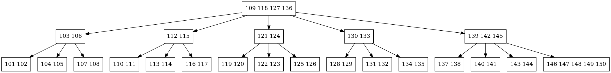
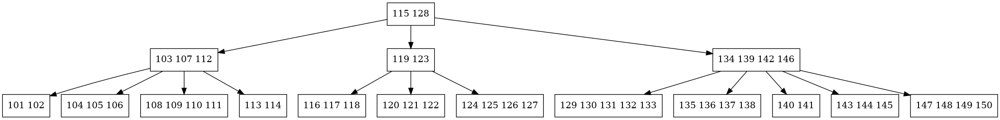
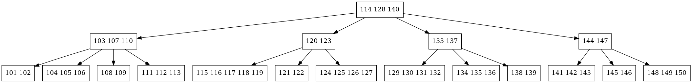
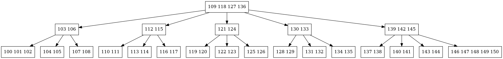
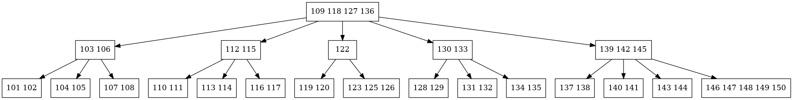

# EDB2 - Terceira Unidade: Implementação de uma Árvore B

**Universidade Federal do Rio Grande do Norte (UFRN)**  
**Centro de Ciências Exatas e da Terra (CCET)**  
**Departamento de Informática e Matemática Aplicada (DIMAp)**  
**Curso: Bacharelado em Ciência da Computação**  

### Participantes
- **Raul Ramalho Lucena** - raulramalho2016@gmail.com
- **Moisés Átila Rodrigues Lima** - moisesignnel@gmail.com
- **Vinicius Honório dos Santos** - vhonorio2003@gmail.com
- **Carlos Henrique da Silva Guimarães** - ch.guimaraes87@gmail.com
- **Tiego Rafael Belo da Rocha** - tiegorafael@gmail.com

### Contribuições:
---
- **Vinicius** - Implementou inserção e busca em uma árvore B e contribuiu na implementação do menu.

- **Raul** - Auxiliou na implementação da inserção, testes manuais e troubleshooting. Gravou o video.

- **Tiego** - Implementação das funções de remoção.


## Video

Assista o breve video de 3 minutos explicando o repositório e o código: 

https://youtu.be/TrX7MbxtwLk


## Descrição do Projeto
Este projeto foi desenvolvido como parte da disciplina **Estruturas de Dados Básicas II (EDB2)** e consiste na implementação de uma **Árvore B**.


O programa contém as seguintes operações:
- **Inserção** de itens na Árvore B.
- **Busca** de itens por seu identificador (ID).
- **Remoção** de itens da Árvore B.
- **Impressão** da árvore por níveis.
- **Embaralhar dados de entrada** como os dados de entrada são obtidos através de um arquivo (.txt), a forma da árvore pode variar dependendo da ordem de inserção dos dados. Esta opção permite embaralhar os dados de entrada para testar diferentes configurações e garantir a robustez da implementação.
- **Geração de visualização** da estrutura da árvore no formato Graphviz (`.dot`).

---
## Hardware, IDE e Tecnicismos

Fora utilizado a linguagem de programação C++ 17 com o compilador gcc 13.3.0.

Especificações da máquina:

8,0 GiB RAM, Intel® Core™ i7-7500U × 4, Intel® HD Graphics 620 (KBL GT2), 64-bit

Editor de texto VSCODE

SO Ubuntu 24.04.1 LTS "noble"
Kernel: Linux 6.8.0-51-generic

## Como Executar o Projeto

### Compilação
Certifique-se de estar na pasta src. Use o comando abaixo para compilar o projeto:  
```bash
g++ main.cpp ArvoreB.cpp No.cpp -o main
```
### Executar
```bash
./main
```
### Como utilizar:
Ao executar o programa, os dados serão lidos a partir do arquivo `dadosB.txt`, conforme requisitado nas especificações do projeto. O arquivo se encontra na pasta `dados`. Caso deseje alterar o arquivo de entrada, basta ir no arquivo `main.cpp` e modificar o caminho do arquivo, por exemplo:
```cpp
string caminhoArquivo = "../dados/dadosB4.txt";
```
O programa vai exibir o menu com as opções do projeto. Basta selecionar a opção desejada. 
```bash
--- MENU ---
1. Buscar item
2. Inserir item
3. Remover item
4. Imprimir árvore por níveis
5. Gerar arquivo .dot da árvore
6. Embaralhar dados de entrada
7. Sair
Escolha uma opção: 
```
Para visualizar a saída, você pode usar a opção 4, que exibe a árvore por nível no terminal, ou a opção 5, que gera o arquivo (`.dot`). Para gerar o arquivo PNG a partir do (`.dot`), use:
```bash
dot -Tpng <nome.dot> -o <nome.png>
```
---
## Exemplos de operações:
### Árvores geradas pelo arquivo `dadosB.txt`
A seguir estão as imagens geradas pelo Graphviz. A primeira árvore foi gerada com os dados do arquivo `dadosB.txt` sem embaralhá-los. As segunda e terceira árvores tiveram os dados embaralhados.

| **Dados inseridos na sequencia do arquivo**                |
|------------------------------------|
|  |

| **Dados inseridos de forma aleatória 1**                |
|------------------------------------|
|  |

| **Dados inseridos de forma aleatória 2**                |
|------------------------------------|
|  |
### Inserção:
Inserindo um item com ID = 100 na árvore.

| **Inserindo: ID = 100**                |
|------------------------------------|
|  |

### Remoção:
Testes de remoção realizados na árvore gerada pelos dados inseridos na sequência do arquivo `dadosB.txt`.

| **removendo: ID = 120**            |
|------------------------------------|
|  |

| **removendo: ID = 124**            |
|------------------------------------|
|  |

| **removendo: ID = 120 e 124**      |
|------------------------------------|
|  |


